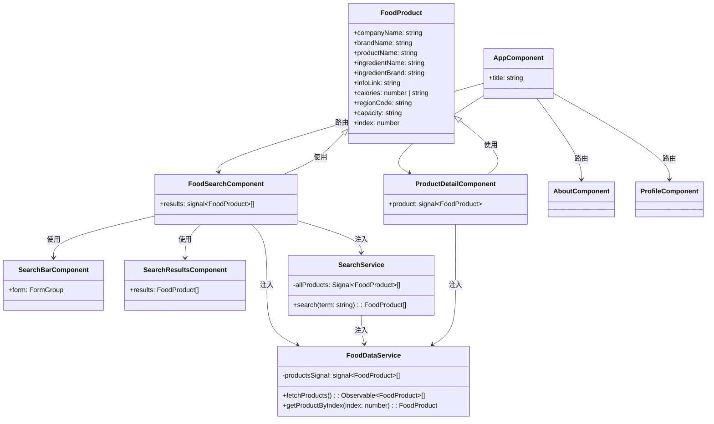

```mermaid
classDiagram
    %% 組件類別
    class AppComponent {
        +title: string
    }

    class FoodSearchComponent {
        +results: signal~FoodProduct~[]
    }

    class SearchBarComponent {
        +form: FormGroup
    }

    class SearchResultsComponent {
        +results: FoodProduct[]
    }

    class ProductDetailComponent {
        +product: signal~FoodProduct~
    }

    class AboutComponent {
    }

    class ProfileComponent {
    }

    %% 服務類別
    class FoodDataService {
        -productsSignal: signal~FoodProduct~[]
        +fetchProducts(): Observable~FoodProduct~[]
        +getProductByIndex(index: number): FoodProduct
    }

    class SearchService {
        -allProducts: Signal~FoodProduct~[]
        +search(term: string): FoodProduct[]
    }

    %% 資料模型
    class FoodProduct {
        +companyName: string
        +brandName: string
        +productName: string
        +ingredientName: string
        +ingredientBrand: string
        +infoLink: string
        +calories: number | string
        +regionCode: string
        +capacity: string
        +index: number
    }

    %% 依賴關係
    FoodSearchComponent --> SearchBarComponent : 使用
    FoodSearchComponent --> SearchResultsComponent : 使用
    FoodSearchComponent --> FoodDataService : 注入
    FoodSearchComponent --> SearchService : 注入
    SearchService --> FoodDataService : 注入
    ProductDetailComponent --> FoodDataService : 注入
    AppComponent --> FoodSearchComponent : 路由
    AppComponent --> AboutComponent : 路由
    AppComponent --> ProfileComponent : 路由
    AppComponent --> ProductDetailComponent : 路由

    %% 類別繼承/關聯
    FoodProduct <|-- FoodSearchComponent : 使用
    FoodProduct <|-- ProductDetailComponent : 使用
```
