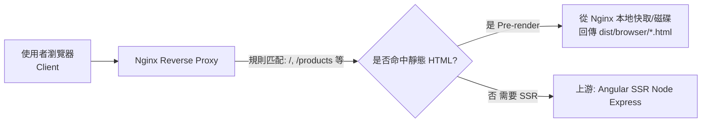

# NgSsr

本專案為 Angular Universal (SSR) 研究專案，旨在探索與實作伺服器端渲染技術。

## 資料來源

本專案使用之資料來自 [政府資料開放平臺](https://data.gov.tw/)，為公開資訊。

## 授權

本專案採用 [MIT License (MIT 開放使用)](./LICENSE) 進行授權。詳細內容請參閱 `LICENSE` 檔案。

---

本專案是使用 [Angular CLI](https://github.com/angular/angular-cli) 19.2.15 版本產生的。

## 開發伺服器

若要啟動本機開發伺服器，請執行：

```bash
ng serve
```

伺服器啟動後，請在瀏覽器中開啟 `http://localhost:4200/`。當您修改任何原始檔案時，應用程式將會自動重新載入。

## 程式碼鷹架

Angular CLI 包含了強大的程式碼 Schematics 工具。若要產生一個新的元件，請執行：

```bash
ng generate component component-name
```

若要取得完整的可用 schematics 清單（例如 `components`、`directives` 或 `pipes`），請執行：

```bash
ng generate --help
```

## 建置專案

若要建置專案，請執行：

```bash
ng build
```

此指令會編譯您的專案，並將建置產物儲存在 `dist/` 目錄中。在生產模式下，建置過程會為您的應用程式進行效能和速度的最佳化。

## 使用 Docker Compose 進行部署

本專案已設定為可使用 Docker Compose 進行生產環境部署。此方式會在獨立的容器中，分別編排 Angular SSR 應用程式和一個 Nginx 反向代理伺服器。

### 環境需求

- 您的機器上已安裝 [Docker](https://www.docker.com/get-started)。
- 您的機器上已安裝 [Docker Compose](https://docs.docker.com/compose/install/)（通常已包含在 Docker Desktop 中）。

### 架構說明

此部署由兩個服務組成：
1.  **`app`**：一個 Node.js 容器，負責建置並執行 Angular Universal (SSR) 應用程式。
2.  **`nginx`**：一個 Nginx 容器，作為反向代理。它會直接提供靜態檔案，並將動態頁面請求轉發到 `app` 服務。

### 設定檔說明

此設定由兩個關鍵檔案定義：

- **`Dockerfile`**：此檔案採用**多階段建置 (multi-stage build)**，為我們的 Angular SSR 應用程式（`app` 服務）建立一個最佳化的 Docker 映像。它會執行以下步驟：
    1.  **Builder 階段**：使用一個完整的 Node.js 映像，安裝所有依賴（包含開發依賴），並執行 `npm run build` 來編譯 Angular 應用程式。
    2.  **Runner 階段**：使用一個輕量的 Node.js 映像，只從 `Builder` 階段複製出建置好的 `dist` 目錄和生產環境所需的 `node_modules`。
    3.  這樣產生的最終映像檔更小、更安全，因為它不包含原始碼或建置工具。

您不需要直接執行此檔案。當您執行 `docker-compose up --build` 指令時，Docker Compose 會自動使用它來建置 `app` 映像。

- **`docker-compose.yml`**：這是我們多容器環境的主要控制檔案。它告訴 Docker 如何執行並連接我們的服務：
    1.  它定義了 `app` 和 `nginx` 這兩個服務。
    2.  對於 `app` 服務，它指定使用當前目錄中的 `Dockerfile` 來建置映像（`build: .`）。
    3.  對於 `nginx` 服務，它指定使用 Docker Hub 上的官方 `nginx:alpine` 映像。
    4.  它設定了埠號映射，將您本機的 `localhost:8080` 流量轉發到 `nginx` 容器的 `80` 埠。
    5.  它管理 `volumes`，將您本機的 `nginx.conf` 設定檔和**建置後的靜態資源**從 `app` 服務掛載到 `nginx` 容器中。

此檔案是您用來管理整個應用程式堆疊的主要介面，需搭配 `docker-compose up` 和 `docker-compose down` 等指令使用。

### 執行步驟

請依照以下步驟部署應用程式：

**1. 使用 Docker Compose 啟動服務**

直接使用 Docker Compose 來建置應用程式映像並在背景啟動所有服務。建置過程會在 Docker 容器內自動完成。

```bash
docker-compose up --build -d
```
- `up`：建立並啟動容器。
- `--build`：當您修改了 Angular 程式碼或 `Dockerfile` 後，請使用此旗標來強制重新建置 `app` 映像。
- `-d`：在分離模式（背景）下執行容器。

**2. 驗證應用程式**

容器啟動後，請在瀏覽器中開啟：

[**http://localhost:8080**](http://localhost:8080)

應用程式應該能正常運作。初始頁面由伺服器端渲染，後續的導航則由客戶端處理。

### 管理部署

- **若要停止服務：**
  ```bash
  docker-compose down
  ```

- **若要檢視日誌：**
  ```bash
  # 檢視所有服務的日誌
  docker-compose logs -f

  # 檢視特定服務（例如 app）的日誌
  docker-compose logs -f app
  ```

## 執行單元測試

若要使用 [Karma](https://karma-runner.github.io) 執行單元測試，請使用以下指令：

```bash
ng test
```

## 執行端對端測試

若要進行端對端（e2e）測試，請執行：

```bash
ng e2e
```

Angular CLI 預設未包含端對端測試框架。您可以選擇適合您需求的框架。

## 更多資源

若要取得更多關於 Angular CLI 的資訊，包含詳細的指令參考，請造訪 [Angular CLI 總覽與指令參考](https://angular.dev/tools/cli) 頁面。

---

## 部署與故障排除筆記

本節記錄了在設定 Angular SSR + Nginx 環境中遇到的問題與解決方案。

### 初始問題：靜態資源 404

- **現象**：訪問預渲染或伺服器端渲染的頁面（如 `/about`）時，頁面本身可以載入，但其對應的 JavaScript 和 CSS 檔案請求回傳 404 錯誤。
- **原因**：`nginx.conf` 中設定的網站根目錄 (`root`) 與 `docker-compose.yml` 中掛載靜態資源的目錄不一致。Nginx 在錯誤的路徑下尋找靜態檔案。
- **解決方案**：修改 `nginx.conf`，將 `root /app/dist/ng-ssr/browser;` 變更為 `root /usr/share/nginx/html;`，使其指向 Docker 容器內正確的靜態資源路徑。

### 需求變更：根路徑重定向

- **需求**：希望使用者訪問根路徑 `http://localhost:8080/` 時，能自動重定向到 `/about` 頁面。
- **解決方案**：
    1.  **後端重定向 (`server.ts`)**：在 Express 伺服器中加入中介軟體，攔截對 `/` 的請求並回傳 HTTP 301 永久重定向。
    2.  **前端重定向 (`app.routes.ts`)**：在 Angular 的路由設定中加入 `{ path: '', pathMatch: 'full', redirectTo: 'about' }`，確保在客戶端的導航也能正確處理。

### 衍生問題與最終修復

在實施重定向後，出現了幾個衍生問題：

1.  **403 Forbidden 錯誤**：
    - **現象**：訪問 `http://localhost:8080/` 時，收到 403 Forbidden 錯誤，而不是預期的重定向。
    - **原因**：Nginx 的 `try_files` 指令在處理 `/` 請求時，找到了網站根目錄，但預設禁止列出目錄內容，且未能將請求正確轉發給後端處理。
    - **解決方案**：在 `nginx.conf` 中新增一個專門的 `location = / { ... }` 區塊，強制將對根路徑的請求直接代理到後端 Node.js 伺服器。

2.  **重定向時埠號遺失**：
    - **現象**：訪問 `http://localhost:8080/` 時，被重定向到 `http://localhost/about/`，遺失了 `8080` 埠號。
    - **原因**：這個問題有兩個層面：
        - **Express 端**：Node.js 伺服器不知道自己運行在反向代理之後，需要明確告知它信任代理傳來的 `X-Forwarded-*` 標頭。
        - **Nginx 端**：當訪問 `/about` (不帶斜線) 時，Nginx 會發出一個到 `/about/` 的重定向，但在這個過程中遺失了埠號。
    - **解決方案**：
        - 在 `server.ts` 中加入 `app.set('trust proxy', true);`，讓 Express 能正確產生包含埠號的重定向 URL。
        - 修改 `nginx.conf` 中的 `try_files` 指令為 `try_files $uri $uri/index.html @proxy;`。這讓 Nginx 在處理 `/about` 這類預渲染頁面時，直接提供其 `index.html` 檔案，而不是發出一個外部重定向，從而根本上避免了 Nginx 端的重定向問題。

經過以上調整，整個應用程式的請求流程變得清晰且高效：
- **`/` 請求** -> Nginx (`location = /`) -> Node.js (`server.ts`) -> 301 重定向
- **`/about` 請求** -> Nginx (`try_files`) -> 直接提供靜態 `about/index.html`
- **`/*.js`, `/*.css` 請求** -> Nginx (`try_files`) -> 直接提供靜態資源
- **其他頁面請求 (如 `/profile`)** -> Nginx (`try_files` 找不到檔案) -> Node.js (`server.ts`) -> 伺服器端渲染 (SSR)

## 網路資源讀取流程

